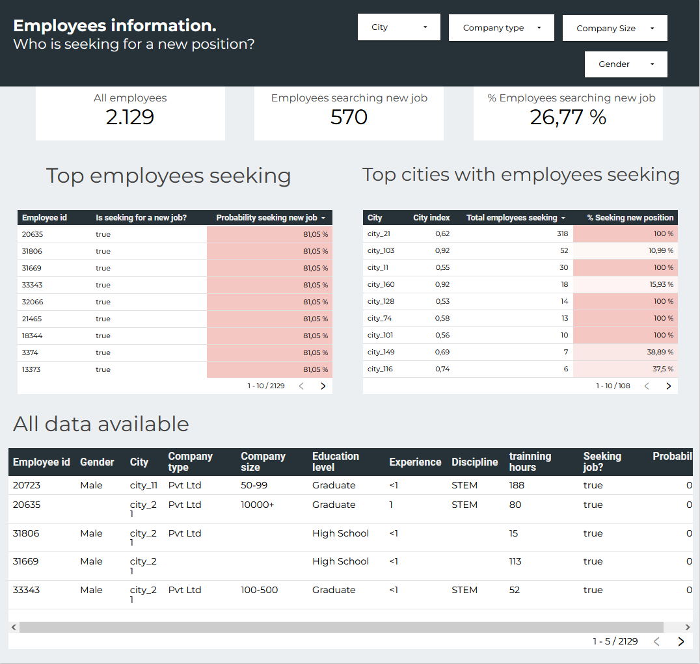

# A real-life example of a binary classification problem with business-minded aspects.
The purpose of this project is to deal with a **real world classification problem and approach it with a business concern**: from explaining the insights we can get just from the data, find a ML model that would fit on the classification problem and finally put into production the model and the insights we can get from it.

For this project I've chosen this Kaggle dataset: [HR Analytics: Job Change of Data Scientists](https://www.kaggle.com/datasets/arashnic/hr-analytics-job-change-of-data-scientists/data). This dataset contains personal information of the employees of different companies and the purpose is to predict which employees wants to leave the company. This is a real business concern because the cost of losing an employee can range from [100% to 150% of the salary for technical positions](https://builtin.com/recruiting/cost-of-turnover), so the objective is to **predict in advance which employees have more probability to leave the company** for being able to take actions in order to reduce the leaving cost. 

Final results are presented in a user friendly [report](https://lookerstudio.google.com/reporting/195aafd5-d954-44bf-b6bc-ced337f02ece/page/RMGnD):

